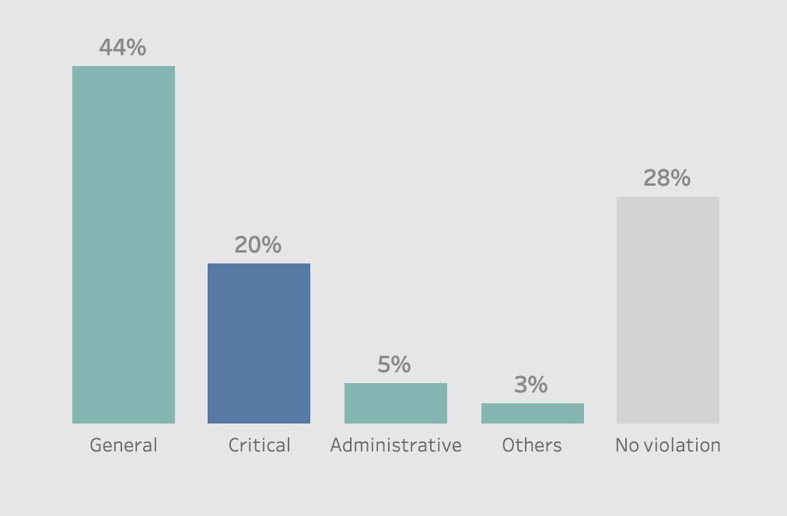
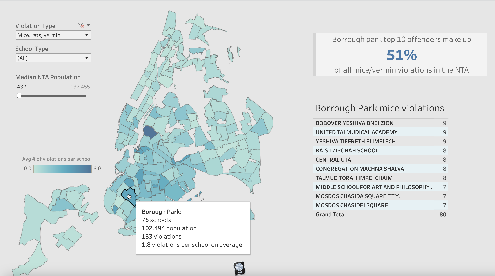

# School Cafeteria violation analysis


# Overview

This study aims to comprehensively understand cafeteria violations in public and private schools, comparing their frequency and severity across various neighborhoods to pinpoint areas with significant public health risks. The analysis is executed in this Jupyter Notebook using **[SQL and Python](https://github.com/feelgd777/SQL_repo/blob/main/notebooks/School%20cafeteria%20violations.ipynb)**, and the visualization is done with **[Tableau](https://public.tableau.com/views/Cafeteriaviolations/Dashboard3?:language=en-US&:display_count=n&:origin=viz_share_link)**.


# Data Understanding

The dataset contains current inspection data for cafeterias permitted in public, private, and parochial schools in NYC. It is provided by Department of Health and Mental Hygiene. The link to the dataset can be found [here](https://data.cityofnewyork.us/Health/DOHMH-School-Cafeteria-Inspections-2020-Present-/5ery-qagt).
Our dataset is on 7,662 violations, 2,125 of which are critical. The violations that are more likely to contribute to food-borne illnesses are considered critical.
They are a substantial risk to the public’s health. Understanding the sources of violations will aid in targeting problematic areas.


# Data Analysis

Main types of cafeteria records: 

* General violations 44% of all records
* Critical violations 20% 
* No violations 28%
* Administrative 5% 
* Nutrition tobacco and others 3%



  
The analysis with **SQL queries** has provided several key insights, including:

1.  The count of private and public schools in the dataset.
2.  The average number of violations per school.
3.  The total count of violations.
4.  The count of unique critical and general violations.
5.  The count of violations by school type.
6.  The distribution of critical and general violations by school type.
7.  The percentage of all violations by school type.
8.  Average number of violations per school by school type.
9.  The top 10 categories for critical violations.
10. The top 10 types of critical violations.
11. The most common critical cafeteria violations.
12. A comparison of NYC boroughs based on the number of violations and average violations per school.
13. The average number of violations per school by borough.
14. The count of critical violations per neighborhood.

These insights provide a comprehensive understanding of the cafeteria violations dataset and help identify patterns and areas of concern related to school cafeterias in NYC.
_____________________________________

## Where do these violation happen?

To determine the average number of violations per school by borough, we ran the following SQL query:

```sql
SELECT 
    Borough,
    ROUND(CAST(COUNT(ViolationDescription) AS FLOAT) /
    COUNT(DISTINCT "Record ID"), 1) as "Average violations",
    COUNT(DISTINCT "Record ID") as "Number of Schools"
FROM schools
WHERE ViolationDescription != 'no violation'
GROUP BY Borough
ORDER BY "Average violations" DESC;
```
***SQL Query Output:***

| Borough        | Average Violations | Number of Schools |
|----------------|--------------------:|-------------------:|
| Brooklyn       | 6.0                | 635                |
| Queens         | 3.9                | 400                |
| Manhattan      | 3.7                | 312                |
| Bronx          | 3.1                | 297                |
| Staten Island  | 2.9                | 79                 |


Brooklyn stands out as having the highest average violation count per school, with an average of 6 violations. Brooklyn is slightly larger in terms of population compared to Queens, but it has over 200 more registered schools as of 2023 and undergoes inspections almost twice as frequently as Queens. This could be attributed to the higher number of violations in Brooklyn, leading to more frequent inspections to ensure compliance and safety.<br><br>

## Examining Tabulation Areas

Taking a closer look at tabulation areas (NTAs) on the map, we find that the median population for these areas is 54,000, with the highest population recorded at 132,000. Some areas immediately draw our attention, such as Borough Park, which exhibits an average of 9.9 cafeteria violations per school. Given our focus on public health risks, we will narrow our analysis to violations related to mice and vermin, as they are the top critical violations.

### Advanced SQL Analysis
To identify neighborhoods with the highest concentration of mice and vermin violations, we employed an advanced SQL query that uses Common Table Expressions (CTEs) and window functions for clearer, more structured analysis.

#### SQL Query Explanation:
- **Using CTEs**: CTEs (Common Table Expressions) simplify complex aggregations, making it easier to break down and manage multi-step queries by referring back to intermediary results.
- **Window Function**: The `RANK()` function orders neighborhoods based on their total violations, enabling us to prioritize intervention areas.

```sql
WITH ViolationCounts AS (
    SELECT
        `NTA Name`,
        COUNT(*) AS `Total Violations`
    FROM schools
    WHERE ViolationLabel = 'Mice, rats, vermin'
    GROUP BY `NTA Name`
)
SELECT
    `NTA Name`,
    `Total Violations`,
    RANK() OVER (ORDER BY `Total Violations` DESC) AS `Violation Rank`
FROM ViolationCounts
LIMIT 10;
```
**SQL Query Output**

| NTA Name                | Total Violations | Violation Rank |
|-------------------------|------------------|----------------|
| Borough Park            | 133              | 1              |
| Williamsburg            | 50               | 2              |
| Bedford                 | 30               | 3              |
| Canarsie                | 23               | 4              |
| Rugby-Remsen Village    | 22               | 5              |
| Flatbush                | 21               | 6              |
| East New York           | 20               | 7              |
| Sunset Park West        | 19               | 8              |
| Crown Heights South     | 19               | 9              |
| Bushwick South          | 19               | 10             |

*This table displays the top 10 neighborhoods ranked by the highest number of mice and vermin violations.*

Among areas with populations exceeding 100,000, Borough Park stands out with 133 mice violations across 75 schools. As shown below, the top 10 schools in Borough Park account for 51% of all violations in the area. Most violations occur in private Jewish orthodox schools, with only one public school in the mix, highlighting a targeted area for public health intervention.


### Tableau Visualization:
The Tableau visualization below further illustrates these findings, highlighting Borough Park as a significant public health concern. The darkest area on the map, Greenpoint, Brooklyn, averages 3 violations per school, but when considering population as a factor, Borough Park's risk is more pronounced. Astonishingly, the top 10 schools in Borough Park account for 51% of all violations in the area. These schools are primarily Jewish orthodox institutions, with only one being public, and the majority of violations originate from private schools.



### Implications

It is clear that certain areas are disproportionately affected by critical school cafeteria violations, posing higher risks to public health. There is a common belief that private schools often have more substantial budgets than public schools. It's possible that this financial flexibility allows some institutions to inadequately allocate resources for facility maintenance and general hygiene. In densely populated areas like Borough Park, there is a pressing need for increased oversight and regulations to safeguard public health.

*To further demonstrate the disparity in violation counts, we ran a query comparing private and public schools in Borough Park.*

```sql
WITH BoroughParkViolations AS (
    SELECT 
        "School Type",
        COUNT(*) AS ViolationsBySchoolType
    FROM schools
    WHERE 
        "NTA Name" = 'Borough Park'
        AND "ViolationDescription" != 'no violation'
        AND ViolationLabel = 'Mice, rats, vermin'
    GROUP BY "School Type"
),
TotalBoroughParkViolations AS (
    SELECT 
        SUM(ViolationsBySchoolType) AS TotalMiceVerminViolationsInBoroughPark
    FROM BoroughParkViolations
)
SELECT 
    bp."School Type" AS SchoolType,
    bp.ViolationsBySchoolType AS MiceVerminViolationsBySchoolType,
    tbp.TotalMiceVerminViolationsInBoroughPark AS TotalMiceVerminViolationsInBoroughPark,
    ROUND((bp.ViolationsBySchoolType * 100.0 / tbp.TotalMiceVerminViolationsInBoroughPark), 2) AS PercentageOfTotalMiceVerminViolationsInBoroughPark
FROM BoroughParkViolations bp
JOIN TotalBoroughParkViolations tbp ON 1=1;
```

| School Type | Mice/Vermin Violations | Total Mice/Vermin Violations in Borough Park | % of Total Mice/Vermin Violations in Borrough Park|
|-------------|-------------------------|----------------------------------|--------------------------------|
| Private     | 121                     | 133                              | 90.98%                         |
| Public      | 12                      | 133                              | 9.02%                          |

*This query uses a CTE to analyze mice/vermin-specific violations in Borough Park, comparing compliance between private and public schools.*

>The results show that private schools are responsible for **roughly 9 out of 10 mice/vermin violations** in Borough Park, while public schools account for only **1 out of 10**. This stark contrast underscores the need for stricter health regulations and more frequent inspections specifically targeting private institutions in high-risk areas.

Prioritizing inspections for private schools in these problematic NTAs is essential to safeguarding public health and creating safer school environments.


# Proposed Solutions

In light of our findings, we recommend the following solutions:

1. **Implement Stringent Requirements for Private Schools**: Enforce stricter health and safety standards for private institutions, particularly those in high-risk areas like Borough Park, to address the high incidence of mice/vermin violations.

2. **Prioritize Inspections in High-Risk NTAs**: Focus inspection efforts on neighborhoods with a history of critical violations to protect public health and prevent recurring issues. Establish a schedule of frequent inspections for schools with past violations to ensure sustained compliance.

3. **Target Densely Populated Areas**: Pay special attention to highly populated neighborhoods, as they present heightened risks for health violations due to increased usage and demand on facilities. Addressing these areas can help reduce overall public health risks within the community.

These measures are essential for creating safer school environments and ensuring consistent health standards across both public and private institutions.


